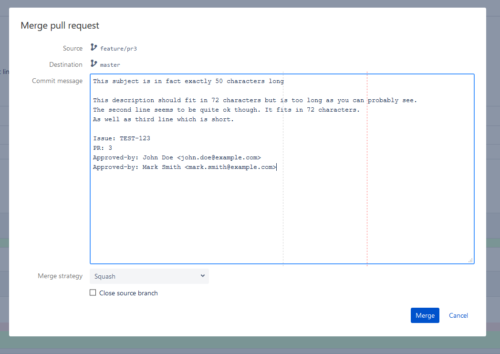

# BitBucket PR Formatter

## Features

* Changes formatting of pull request commit message to:
    ```
    <PR title>

    <PR description>

    <Trailers>
    ```
* Makes commit message input bigger
* Adds vertical guidelines at 50 and 72 characters to help keep proper line breaks
* Appends `PR: <id>` to message trailers

## Installation

1. Install Tampermonkey or any other user script manager:
    * [Tampermonkey for Chrome](https://chrome.google.com/webstore/detail/tampermonkey/dhdgffkkebhmkfjojejmpbldmpobfkfo)
    * [Tampermonkey for Firefox](https://addons.mozilla.org/pl/firefox/addon/tampermonkey)
2. Open user script file in browser: https://github.com/lpatalas/PRFormatter/raw/master/prformatter.user.js
3. Extension should automatically ask to install the script

## Example

[](img/example.png)
